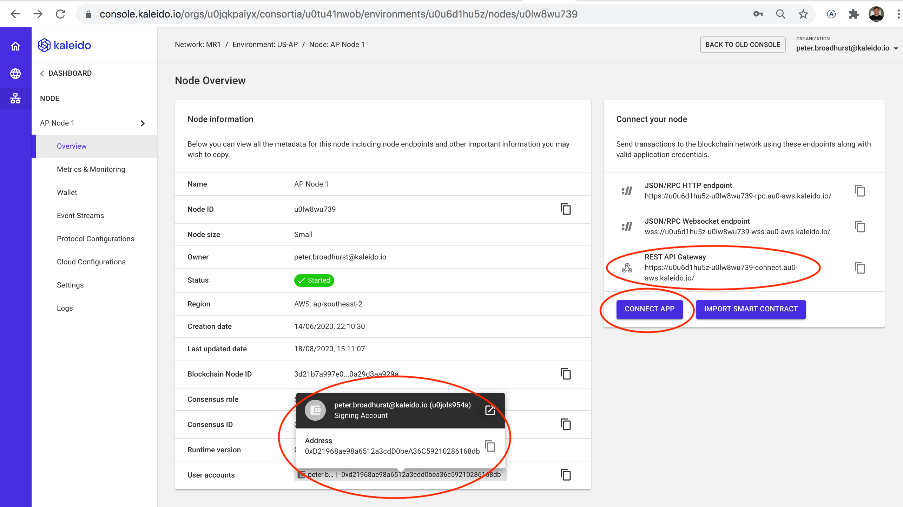

# Kaleido Developer Challenge: (Nostr + Twitter) as a DApp

## Introduction

This is a simplified implementation of the Nostr+Twitter as a DApp. Nostr is a keypair-based protocol (it's not a blockchain technology, but instead implemented originally as websocket nodes that store things. [read more here](https://github.com/nostr-protocol/nostr)). This DApp is built using React, Node.js, Solidity, and Kaleido blockchain. The DApp is a simple web application that allows users to create a post that are visible to others. The posts are stored on the blockchain and are visible to all users. The DApp also allows users to follow other users and see a feed of their following.

## How to run the DApp

Configure the config file:

- Go to the Kaleido console page for your node
  - `KALEIDO_REST_GATEWAY_URL`: Grab the `REST API Gateway` URL
  - `FROM_ADDRESS`: Grab the `User account` - this will be your managed wallet signing key
    
- Click the `Connect App` button in the Kaleido console on your blockchain node
  - Then `Create new App Cred` create yourself a secure credential
- Once on the `App Cred Details` page you will need:
  - `KALEIDO_AUTH_USERNAME`: The generated `ID` (the username)
  - `KALEIDO_AUTH_PASSWORD`: The generated `Password`
    

Copy [backend/config.example.json](backend/config.example.json) to `backend/config.json` and edit it to the values from the Kaleido Connect panel.

Then:

1. Clone the repo
2. Run `npm install` in the `backend` and `frontend` folders
3. Run `npm start` in the `backend` and `frontend` folders
4. Open `http://localhost:3000` in your browser

## How to use the DApp

1. Install Metamask and create an account
2. Connect Metamask to the Kaleido blockchain network ([see here for instructions](https://docs.kaleido.io/developers/smart-contracts/metamask/))
3. Go to `http://localhost:3000` in your browser
4. Click on login (your active account in Metamask will be used)
5. on the home page, you can see all the posts (which is also visible without logging in)
6. On the feed page, you can see the posts of the users you are following
7. On top of both home and feed pages, you can create a post
8. Click on the name of a user to go to their profile page where you can (un)follow them and see their posts
9. on the right side of pages, you can see the list of users you are following
10. Enjoy!

---

## How it works

### Backend

The backend is a Node.js server that uses Express.js to handle requests. The backend also uses the Kaleido OpenAPI generated endpoints to interact with the blockchain. The backend is responsible for the following:

Users routes:
- `POST /api/users/login`: Login a user (or create a new user if they don't exist)
- `GET /api/users`: Get all users
- `POST /api/users/follow`: Follow a user
- `POST /api/users/unfollow`: Unfollow a user
- `GET /api/users/isFollowed`: Check if a user is followed by another user
- `GET /api/users/following`: Get the list of users a user is following
- `GET /api/users/:publicKey`: Get a user by their public key

Posts routes:
- `GET /api/posts`: Get all posts
- `POST /api/posts`: Create a post
  - The posts are signed by the user's private key and it's validated by the backend before being added to the blockchain
- `GET /api/posts/:id`: Get a post by its id

Backend websockets:

The backend also uses websockets to communicate the post stream as they are added. It uses Socket.io to implement websocket servers/client and emits the following events:

- `newSubscribedPost`: emits a post to the followers when it is added to the blockchain ([socket.io rooms](https://socket.io/docs/v4/rooms/) are used to send the post to the followers of the user who created the post)
- `newPost`: emits a post when it is added to the blockchain (used to update the home page)
- `login`: will set up the websocket connection for a user, configure which rooms the user is in
- `logout`: will remove the user from the websocket connection and all the socket.io rooms

### Frontend

The frontend is a React application that uses the backend to interact with the blockchain. The frontend is responsible for the following:

- Home page: shows all the posts (also visible without logging in)
  
- Feed page: shows the posts of the users the current user is following
  
- User profile page: shows the posts of a user and allows the user to follow/unfollow the user
  
- Left side bar: shows navigation links and login/logout button
- Right side bar: shows the list of users the current user is following
- "create post" box on top of both _home and feed pages: allows the user to create a post_
  - _the posts are signed by the user's private key + metamask and are validated by the backend before being added to the blockchain_

> _home and feed pages stream the posts as they are added to the blockchain using websockets_

I tried to use Kaleido UI colors as much as possible, and keep the UI simple and clean.

### Smart contract

The smart contract is written in Solidity and is deployed on the Kaleido blockchain. The smart contract is available [in the `contracts` folder](./backend/contracts/nostr.sol).
